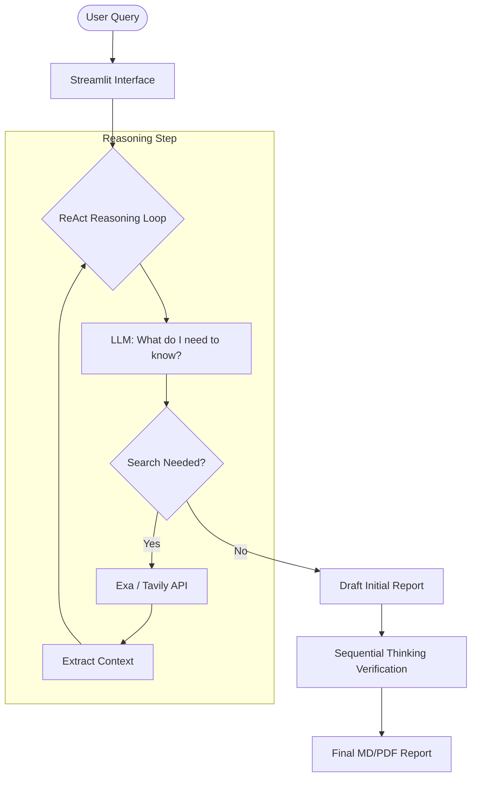

# Deep Research Agent 🔍

A powerful, autonomous research assistant that performs deep, multi-step investigations using configurable LLM models via OpenRouter. This Streamlit application mimics human-like research patterns by cycling through thought, action, and observation.

## 🚀 Key Features

-   **Autonomous Reasoning (ReAct Loop)**: The agent doesn't just answer; it thinks, searches, and evaluates information in real-time.
-   **Sequential Thinking Verification**: A sophisticated second-pass validation that cross-checks the agent's initial findings against search results to identify and correct potential hallucinations.
-   **Hybrid Search Model**:
    -   **Discovery (Exa)**: Broad landscape analysis and semantic resource discovery.
    -   **Verification (Tavily)**: Targeted fact-checking and precise data retrieval.
-   **Intelligent Temporal Grounding**: Automatically detects date-specific queries (e.g., "latest events in December 2025") and applies dynamic search filters to ensure zero-day freshness.
-   **Multi-Model Versatility**: Integrated with OpenRouter to support top-tier models:
    -   **Xiaomi MiMo-V2-Flash** (State-of-the-Art Deep Research Model)
    -   **Tongyi DeepResearch 30B** (Research-optimized)
    -   **GPT-4o** & **Claude 3.5 Sonnet**
    -   **Gemini 2.0 Flash** & **Llama 3.1 70B**
-   **Transparent UI**: 
    -   **🧠 Reasoning Tab**: Live stream of the agent's internal thought process.
    -   **📊 Report Tab**: Clean, professionally formatted research summary.
-   **Export Ready**: One-click downloads for PDF and Markdown reports.

## 🏗️ How It Works

The agent operates on a **ReAct (Reason + Act)** framework:

1.  **Analyze**: Understands the user's intent and breaks it down into sub-objectives.
2.  **Act**: Executes search queries using Exa or Tavily based on the required depth.
3.  **Observe**: Parses search results and extracts relevant facts.
4.  **Synthesize**: Updates its internal state and decides whether to continue searching or conclude.
5.  **Verify**: Perform a final "Sequential Thinking" pass to ensure every claim is backed by the retrieved context.



## 🛠️ Project Structure

| Component | Responsibility |
| :--- | :--- |
| `app.py` | UI/UX layer, session state, and streaming management. |
| `utils.py` | The "brain" of the agent—ReAct logic, search wrappers, and verification. |
| `config.py` | Centralized settings for models, rate limits, and timeouts. |
| `assets/` | Fonts and static resources for PDF generation. |

## ⚙️ Setup & Installation

### Prerequisites
- Python 3.9+
- [OpenRouter API Key](https://openrouter.ai/) (Required)
- [Tavily](https://tavily.com/) or [Exa](https://exa.ai/) API Keys (Recommended for search)

### Installation
```bash
git clone <repository-url>
cd deep-research-agent
python -m venv venv
source venv/bin/activate  # On Windows: venv\Scripts\activate
pip install -r requirements.txt
```

### Running the App
```bash
streamlit run app.py
```

## 📋 Configuration
Modify `config.py` to:
- Change the **Default Model** (current: Xiaomi MiMo-V2-Flash).
- Adjust **Search Depth** (min/max results).
- Set **Rate Limits** to manage API costs.

---
*Built for deep insights, not just quick answers.*